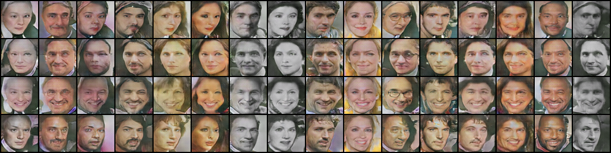
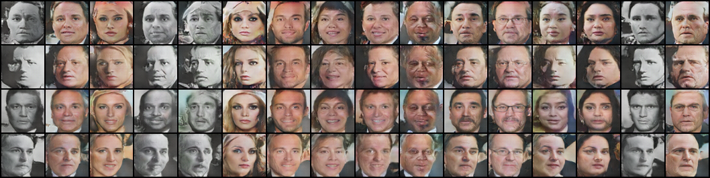

### Semantically Decomposing the Latent Spaces of Generative Adversarial Networks
[SDGAN]:(https://arxiv.org/abs/1705.07904)

1. Comparison of discriminator architecture on MS-Celeba_1M

* Result of SDGAN(stack the feature map along channels)

* Result of SDGAN(stack in RGB)

---------------------

1. Decompose latent space into identities and observations. Z = [Z_i, Z_o]

2. Pairwise training scheme(Generator share weights, Discriminator share weights with D_e, Siamese setup for learning generating a pair of images(same identity).  

